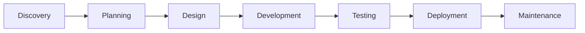

> Building innovative digital solutions with cutting-edge technologies

## 🚀 About Us

Sequence Innovations is a full-stack web development company specializing in creating scalable, modern web applications. We transform ideas into powerful digital solutions using the latest technologies and best practices.

## 💻 Tech Stack

### Frontend

### Backend

### DevOps & Tools

## 🎯 Our Services

### 🌐 Full-Stack Development
- Custom web applications from concept to deployment
- RESTful API and GraphQL development
- Real-time applications with WebSocket integration
- Progressive Web Apps (PWA)

### 📱 Frontend Excellence
- Responsive, mobile-first design
- Component-based architecture
- State management solutions
- Performance optimization

### 🔧 Backend Solutions
- Scalable server architecture
- Database design and optimization
- Authentication and authorization systems
- API integration and third-party services

### ☁️ Cloud & DevOps
- CI/CD pipeline setup
- Cloud migration and deployment
- Infrastructure as Code (IaC)
- Monitoring and logging solutions

## 📊 Featured Projects

### 🛒 E-Commerce Platform
Modern e-commerce solution built with Next.js, featuring real-time inventory, payment processing, and admin dashboard.
- **Tech**: Next.js, TypeScript, Stripe, PostgreSQL
- **Features**: SSR/SSG, Real-time updates, Multi-vendor support

### 📈 Analytics Dashboard
Enterprise analytics platform with data visualization and reporting capabilities.
- **Tech**: React, D3.js, Node.js, MongoDB
- **Features**: Real-time data, Custom charts, Export functionality

### 🤝 Collaboration Tool
Team collaboration platform with video conferencing and project management.
- **Tech**: Next.js, WebRTC, Socket.io, Redis
- **Features**: Video calls, Real-time chat, File sharing

## 🛠️ Our Development Process

1. **Discovery** - Understanding your requirements and goals
2. **Planning** - Technical architecture and project roadmap
3. **Design** - UI/UX design and prototyping
4. **Development** - Agile development with regular updates
5. **Testing** - Comprehensive testing and QA
6. **Deployment** - Smooth deployment and go-live
7. **Maintenance** - Ongoing support and updates

## 📝 Code Standards

We follow industry best practices:
- **Clean Code** - Readable, maintainable, and scalable
- **TypeScript** - Type-safe development
- **Testing** - Unit, integration, and E2E testing
- **Documentation** - Comprehensive code documentation
- **Version Control** - Git flow and semantic versioning

## 🤝 Let's Work Together

Ready to bring your ideas to life? We'd love to hear from you!

- 🌐 [Visit our website](https://sequenceinnovations.com/)
- 📧 [Email us](mailto:hello@sequenceinnovations.com)
- 📅 [Schedule a consultation](#)

## 📄 License

© 2024 Sequence Innovations. All rights reserved.

---

Built with ❤️ by Sequence Innovations

*Last updated: 2025-07-08*
